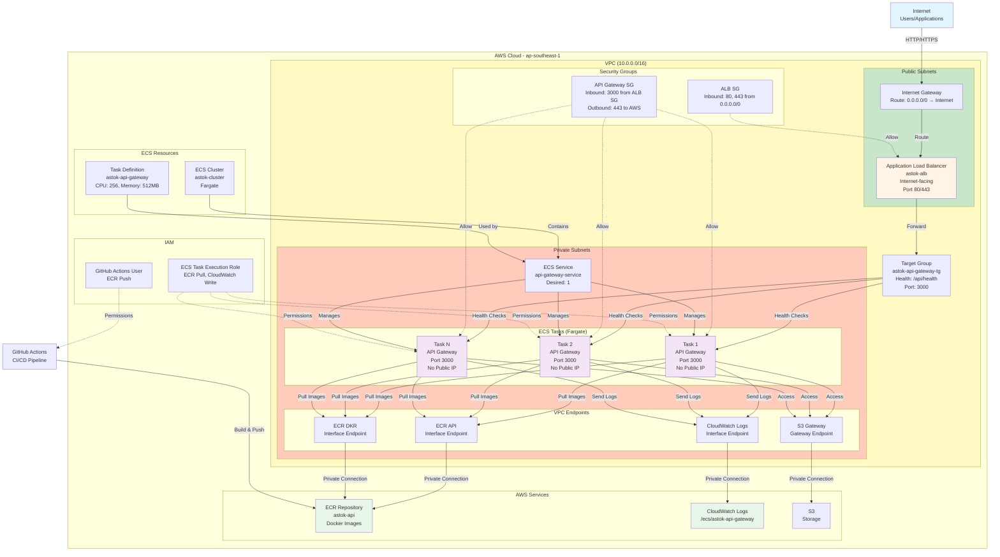

# AWS Architecture Diagram (Mermaid)

## System Architecture



## Component Explanation

### 🌐 Internet

**Mục đích**: Source của tất cả requests từ users/applications

---

### 🔵 Internet Gateway (IGW)

**Vị trí**: VPC Level  
**Mục đích**:

- Cổng kết nối VPC với Internet
- Route traffic từ internet vào VPC và ngược lại
- ALB cần IGW để nhận HTTP/HTTPS requests

**Cấu hình**:

- Attached to VPC
- Route trong public subnets: `0.0.0.0/0 → IGW`

---

### 🟢 Application Load Balancer (ALB)

**Tên**: `astok-alb`  
**Vị trí**: Public Subnets  
**Scheme**: internet-facing  
**Type**: Application Load Balancer (Layer 7)

**Mục đích**:

- **Traffic Distribution**: Phân phối requests đến các healthy ECS tasks
- **High Availability**: Nếu 1 task fail, traffic tự động route đến task khác
- **Health Checks**: Monitor và loại bỏ unhealthy targets
- **Single Entry Point**: Một DNS duy nhất cho tất cả requests
- **SSL Termination**: Xử lý HTTPS certificates (khi có)

**Cấu hình**:

- Listeners: HTTP (80), HTTPS (443)
- Target Group: `astok-api-gateway-tg`
- Health Check: `/api/health`, timeout 10s
- Security Group: Cho phép port 80, 443 từ internet

**Tại sao cần**:

- **Scalability**: Dễ dàng scale bằng cách tăng số lượng tasks
- **Reliability**: Tự động failover nếu task unhealthy
- **Performance**: Load balancing giúp phân phối đều traffic

---

### 🟡 Target Group

**Tên**: `astok-api-gateway-tg`  
**Protocol**: HTTP  
**Port**: 3000  
**Target Type**: IP

**Mục đích**:

- Định nghĩa targets (ECS tasks) cho ALB
- Health checks: Monitor health của từng target
- Load balancing: Phân phối traffic đến healthy targets

**Cấu hình**:

- Health Check Path: `/api/health`
- Health Check Interval: 30s
- Health Check Timeout: 10s
- Healthy Threshold: 2 consecutive successes
- Unhealthy Threshold: 3 consecutive failures

**Tại sao cần**:

- ALB cần biết targets nào healthy để route traffic
- Tự động loại bỏ unhealthy targets
- Tự động register/deregister tasks khi start/stop

---

### 🟣 ECS Cluster

**Tên**: `astok-cluster`  
**Type**: Fargate (serverless)

**Mục đích**:

- Container orchestration platform
- Quản lý và chạy Docker containers
- Auto scaling và health monitoring

**Tại sao dùng Fargate**:

- **No Server Management**: Không cần quản lý EC2 instances
- **Auto Scaling**: Tự động scale dựa trên demand
- **Cost Effective**: Chỉ trả tiền cho resources thực sự dùng
- **Integration**: Tích hợp tốt với ALB, CloudWatch, IAM

---

### 🟣 ECS Service

**Tên**: `api-gateway-service`  
**Desired Count**: 1 (có thể tăng)

**Mục đích**:

- **Task Management**: Quản lý số lượng tasks (desired count)
- **Auto Restart**: Tự động restart nếu task fail
- **Rolling Updates**: Update không downtime
- **ALB Integration**: Tự động register tasks vào target group

**Cấu hình**:

- Launch Type: FARGATE
- Network: Private subnets, no public IP
- Load Balancer: ALB target group
- Health Checks: ECS container health checks

**Tại sao cần**:

- Đảm bảo luôn có đủ số lượng tasks chạy
- Tự động recover nếu task fail
- Zero-downtime deployments

---

### 🟣 ECS Tasks (Fargate)

**Type**: Fargate  
**Network**: Private subnets, no public IP

**Mục đích**:

- Chạy API Gateway containers
- Xử lý HTTP requests từ ALB
- Gửi logs lên CloudWatch

**Cấu hình**:

- CPU: 256 (0.25 vCPU)
- Memory: 512 MB
- Port: 3000
- Health Check: `curl -f -s http://localhost:3000/api/health`

**Tại sao ở Private Subnets**:

- **Security**: Không có public IP, không thể truy cập từ internet
- **Defense in Depth**: Nhiều lớp bảo mật
- **Isolation**: Chỉ ALB có thể reach tasks

---

### 🔵 Task Definition

**Family**: `astok-api-gateway`  
**Mục đích**: Template định nghĩa container

**Cấu hình**:

- Image: ECR repository (`astok-api:latest`)
- CPU: 256
- Memory: 512 MB
- Port: 3000
- Environment Variables: PORT, ORDER_SERVICE_GRPC_HOST, etc.
- Health Check: `curl -f -s http://localhost:3000/api/health`
- Logging: CloudWatch Logs

**Tại sao cần**:

- Template: Định nghĩa cách chạy container
- Reusability: Dùng cho nhiều tasks
- Versioning: Mỗi update tạo version mới

---

### 🟢 ECR (Elastic Container Registry)

**Repository**: `astok-api`  
**Mục đích**: Lưu trữ Docker images

**Workflow**:

```
GitHub Actions → Build Image → Push to ECR → ECS Pull → Run Container
```

**Tại sao cần**:

- **Image Storage**: Lưu trữ Docker images
- **Versioning**: Mỗi image có tag (latest, commit-sha)
- **Security**: Image scanning tự động phát hiện vulnerabilities
- **Integration**: ECS tự động pull images từ đây

---

### 🟢 CloudWatch Logs

**Log Group**: `/ecs/astok-api-gateway`  
**Mục đích**: Lưu trữ logs từ applications

**Tại sao cần**:

- **Centralized Logging**: Tất cả logs ở một nơi
- **Debugging**: Dễ debug khi có lỗi
- **Monitoring**: Có thể tạo alarms dựa trên logs
- **Retention**: Tự động xóa logs sau một thời gian

---

### 🔴 Security Groups

#### ALB Security Group

**Tên**: `astok-alb-sg`  
**Mục đích**: Firewall rules cho ALB

**Inbound Rules**:

- Port 80 (HTTP): `0.0.0.0/0` (từ internet)
- Port 443 (HTTPS): `0.0.0.0/0` (từ internet)

**Tại sao cần**:

- ALB cần nhận HTTP/HTTPS requests từ internet
- Port 80 cho HTTP, 443 cho HTTPS

---

#### API Gateway Security Group

**Tên**: `astok-api-gateway-sg`  
**Mục đích**: Firewall rules cho ECS tasks

**Inbound Rules**:

- Port 3000: Chỉ từ ALB Security Group

**Outbound Rules**:

- Port 443 (HTTPS): `0.0.0.0/0` (cho ECR, CloudWatch)

**Tại sao cần**:

- **Least Privilege**: Chỉ cho phép traffic từ ALB
- **Security**: Không cho phép từ internet trực tiếp
- **Outbound**: Cho phép ECR pull images và CloudWatch logs

---

### 🟠 VPC Endpoints

#### ECR API Endpoint (Interface)

**Service**: `com.amazonaws.ap-southeast-1.ecr.api`  
**Mục đích**: Kết nối private đến ECR API để authenticate

**Tại sao cần**:

- ECS tasks cần authenticate với ECR để pull images
- Không cần internet access (bảo mật hơn)
- Không cần NAT Gateway (tiết kiệm ~$32/tháng)

---

#### ECR DKR Endpoint (Interface)

**Service**: `com.amazonaws.ap-southeast-1.ecr.dkr`  
**Mục đích**: Kết nối private để pull Docker images từ ECR

**Tại sao cần**:

- ECS tasks cần pull Docker images
- Traffic không đi qua internet (bảo mật và nhanh hơn)

---

#### CloudWatch Logs Endpoint (Interface)

**Service**: `com.amazonaws.ap-southeast-1.logs`  
**Mục đích**: Kết nối private để gửi logs lên CloudWatch

**Tại sao cần**:

- ECS tasks cần gửi logs lên CloudWatch
- Centralized logging: Tất cả logs ở một nơi

---

#### S3 Gateway Endpoint

**Service**: `com.amazonaws.ap-southeast-1.s3`  
**Mục đích**: Kết nối đến S3 (nếu cần)

**Tại sao cần**:

- Miễn phí (Gateway endpoint)
- Nếu application cần access S3

---

### 🔵 VPC (Virtual Private Cloud)

**CIDR**: `10.0.0.0/16`  
**Mục đích**: Tạo mạng riêng ảo để cô lập resources

**Cấu hình**:

- DNS Support: Enabled
- DNS Hostnames: Enabled

**Tại sao cần**:

- **Security**: Cô lập mạng, kiểm soát traffic
- **Compliance**: Đáp ứng yêu cầu bảo mật
- **Flexibility**: Tự do cấu hình network

---

### 🟡 Public Subnets

**CIDR**:

- Subnet 1: `10.0.1.0/24` (AZ: ap-southeast-1a)
- Subnet 2: `10.0.2.0/24` (AZ: ap-southeast-1b)

**Mục đích**:

- Host ALB (cần internet access)
- Có route đến Internet Gateway

**Cấu hình**:

- Route Table: Route `0.0.0.0/0` → Internet Gateway
- Map Public IP: Enabled (cho ALB)

**Tại sao cần**:

- ALB cần internet access để nhận requests
- Multi-AZ: High availability

---

### 🟠 Private Subnets

**CIDR**:

- Subnet 3: `10.0.3.0/24` (AZ: ap-southeast-1a)
- Subnet 4: `10.0.4.0/24` (AZ: ap-southeast-1b)

**Mục đích**:

- Host ECS tasks (không có public IP)
- Host VPC Endpoints
- Bảo mật: Không expose trực tiếp ra internet

**Cấu hình**:

- No route to Internet Gateway (bảo mật)
- Map Public IP: Disabled
- VPC Endpoints: Cho phép kết nối đến AWS services

**Tại sao cần**:

- **Security**: Tasks không có public IP
- **Defense in Depth**: Nhiều lớp bảo mật
- **Cost**: Không cần NAT Gateway

---

### 🔴 IAM Roles

#### ECS Task Execution Role

**Tên**: `ecsTaskExecutionRole`  
**Mục đích**: Permissions cho ECS tasks

**Permissions**:

- ECR: Pull images
- CloudWatch Logs: Write logs
- Secrets Manager: Read secrets (nếu dùng)

**Tại sao cần**:

- Tasks cần permissions để pull images và gửi logs
- Security: Không hardcode credentials

---

#### GitHub Actions IAM User

**Tên**: `github-actions-astok`  
**Mục đích**: Permissions cho GitHub Actions

**Permissions**:

- ECR: Push images, get authorization token

**Tại sao cần**:

- GitHub Actions cần credentials để push images
- Least Privilege: Chỉ có quyền ECR

---

## Data Flow

### 1. Request Flow

```
User → Internet → IGW → ALB → Security Group → ECS Task → Response
```

**Chi tiết**:

1. User gửi HTTP request đến ALB DNS
2. Internet Gateway route request đến ALB
3. ALB nhận request, check target health
4. ALB route request đến healthy ECS task (port 3000)
5. Security Group cho phép traffic từ ALB
6. ECS Task xử lý request và trả response
7. Response đi ngược lại qua ALB đến user

---

### 2. Image Pull Flow

```
ECR → VPC Endpoint (ECR API) → ECS Task → VPC Endpoint (ECR DKR) → Pull Image
```

**Chi tiết**:

1. ECS Task cần pull image từ ECR
2. VPC Endpoint (ECR API) authenticate request
3. VPC Endpoint (ECR DKR) pull Docker image
4. Image được download về task
5. Container start với image mới

---

### 3. Log Flow

```
ECS Task → VPC Endpoint (CloudWatch Logs) → CloudWatch Logs → Log Group
```

**Chi tiết**:

1. Application gửi logs
2. ECS Task forward logs
3. VPC Endpoint (CloudWatch Logs) route logs
4. CloudWatch Logs lưu vào log group

---

### 4. CI/CD Flow

```
GitHub → GitHub Actions → Build Image → Push to ECR → ECS Pull → Deploy
```

**Chi tiết**:

1. Developer push code lên GitHub
2. GitHub Actions trigger build
3. Build Docker image
4. Push image lên ECR
5. ECS Service tự động pull image mới
6. Deploy tasks với image mới

---

## Security Architecture

### Defense in Depth Layers

1. **Network Level**:

   - VPC: Cô lập mạng
   - Subnets: Tách public/private
   - Security Groups: Firewall rules

2. **Application Level**:

   - Tasks ở private subnets (no public IP)
   - Chỉ ALB có thể reach tasks
   - Health checks monitor application health

3. **Access Level**:
   - IAM Roles: Least privilege
   - No hardcoded credentials
   - VPC Endpoints: Private connectivity

---

## High Availability

### Multi-AZ Deployment

- **ALB**: 2 public subnets (2 AZs)
- **ECS Tasks**: 2 private subnets (2 AZs)
- **VPC Endpoints**: 2 private subnets (2 AZs)

**Lợi ích**:

- Nếu 1 AZ down, service vẫn chạy ở AZ khác
- Load distribution across AZs
- Fault tolerance

---

## Cost Optimization

### VPC Endpoints vs NAT Gateway

- **VPC Endpoints**: ~$21/tháng (3 Interface endpoints × $7)
- **NAT Gateway**: ~$32/tháng + data transfer

**Tiết kiệm**: ~$11/tháng + data transfer costs

### Fargate vs EC2

- **Fargate**: Pay per use, no server management
- **EC2**: Fixed cost, need to manage instances

**Lợi ích**: Chỉ trả tiền cho resources thực sự dùng

---

## Monitoring & Logging

### CloudWatch Logs

- Centralized logging
- Real-time log streaming
- Log retention policies

### Health Checks

- **ALB Health Checks**: Monitor target health
- **ECS Health Checks**: Monitor container health
- Auto restart unhealthy containers

---

## Scalability

### Horizontal Scaling

- Tăng desired count trong ECS Service
- ALB tự động distribute traffic
- Auto scaling có thể config dựa trên metrics

### Vertical Scaling

- Tăng CPU/Memory trong Task Definition
- Register new task definition
- Update service với task definition mới

---

## Best Practices Applied

1. ✅ **Multi-AZ**: High availability
2. ✅ **Private Subnets**: Security
3. ✅ **VPC Endpoints**: Cost optimization
4. ✅ **Security Groups**: Least privilege
5. ✅ **Health Checks**: Auto recovery
6. ✅ **IAM Roles**: No hardcoded credentials
7. ✅ **Centralized Logging**: Easy debugging
8. ✅ **Fargate**: No server management
